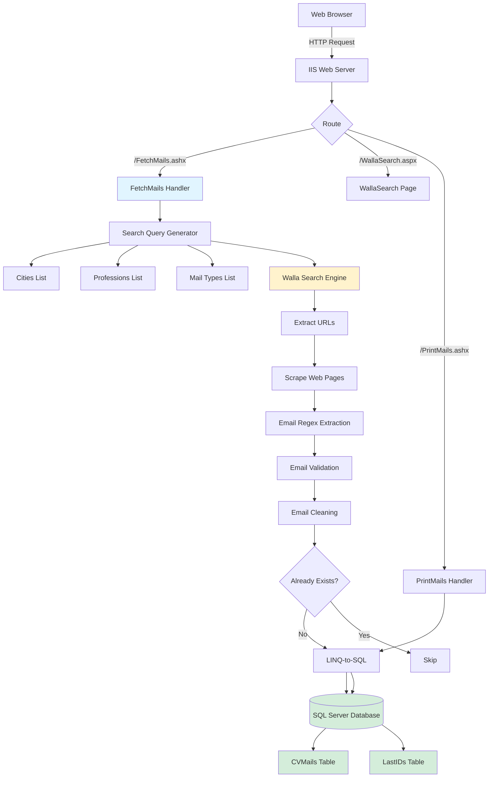
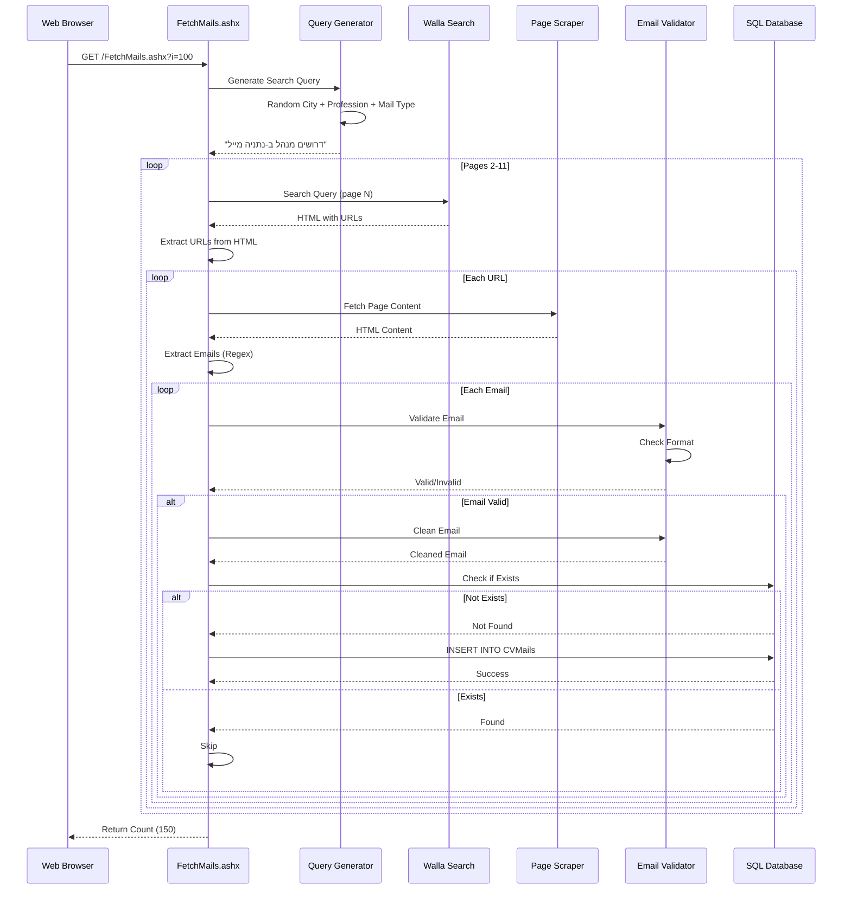

# Cv Spider V2

An ASP.NET web application that automates job search email collection by scraping Israeli search engines (Walla/Google) for job listings and extracting contact email addresses.

Built in February 2013 on the ASP.NET framework, the system programmatically scrapes Israeli search engines, leveraging custom-designed search patterns to query Walla (via its Google-backed source architecture) and Bing. The application dynamically parses HTML results to extract valid employer contact emails, filtering out noise to ensure data quality.

## Features

### Core Capabilities

- **Automated Job Search**: Generates intelligent search queries combining cities, professions, and email keywords
- **Email Extraction**: Uses regex patterns to extract email addresses from web pages
- **Email Validation**: Validates and filters out invalid email formats
- **Email Cleaning**: Automatically fixes common typos and malformed email addresses
- **Database Storage**: Stores unique emails in SQL Server with timestamps
- **Deduplication**: Prevents storing duplicate email addresses
- **Random Search**: Randomly combines search parameters for comprehensive coverage
- **Israeli Market Focus**: Optimized for Hebrew job listings in Israeli cities
- **Thread-Safe**: Uses locking mechanisms for concurrent database operations

### Technical Excellence

- **Clean Architecture**: Organized into BLL, DAL, and UI layers for maintainability
- **LINQ-to-SQL ORM**: Modern data access with type safety and deferred execution
- **Thread Safety**: Robust locking mechanisms for concurrent web requests
- **Optimized Regex**: High-performance regular expressions for data extraction
- **Fault Tolerance**: Basic error handling for network and database issues

### Developer Experience

- **Component-Based Design**: Reusable BLL/DAL components
- **Configuration-Driven**: Easily customizable search parameters (cities, professions)
- **Developer-Friendly Tools**: Built-in handlers for testing and viewing results
- **Detailed Documentation**: Comprehensive setup and usage instructions

## System Architecture



## Data Flow



## Available Scripts

### Email Fetching

The main script for discovering and extracting new email addresses from the web.

**Usage:**

- Access `FetchMails.ashx` via browser or HTTP client.
- Optional: Pass `?i=count` to track total results.

### Email Viewing

Displays all collected emails from the database in a simple, readable format.

**Usage:**

- Access `PrintMails.ashx` to see the current list of extracted emails.

### Legacy Search

An ASP.NET Web Forms page for manual search and validation.

**Usage:**

- Navigate to `WallaSearch.aspx` for the manual interface.

## Getting Started

### Prerequisites

- Windows OS (for IIS hosting)
- .NET Framework 3.5 or higher
- SQL Server (2008 or higher)
- Visual Studio (2010 or higher) or any ASP.NET IDE
- IIS (Internet Information Services)

### Installation

1. Clone the repository:

```bash
git clone https://github.com/orassayag/cv-spider-v2.git
cd cv-spider-v2
```

2. Set up SQL Server database:

```sql
CREATE DATABASE CVBilly3;

CREATE TABLE CVMails (
    asdws BIGINT PRIMARY KEY IDENTITY(1,1),
    Mail NVARCHAR(255) UNIQUE NOT NULL,
    Date DATETIME NOT NULL
);

CREATE TABLE LastIDs (
    sdfsdgdf NVARCHAR(10) PRIMARY KEY,
    LastID1 BIGINT NOT NULL
);

INSERT INTO LastIDs (sdfsdgdf, LastID1) VALUES ('1', 0);
```

3. Update connection string in `web.config`:

```xml
<connectionStrings>
  <add name="DB"
       connectionString="Data Source=YOUR_SERVER;Initial Catalog=CVBilly3;Integrated Security=True;"
       providerName="System.Data.SqlClient" />
</connectionStrings>
```

4. Build LINQ-to-SQL mapping:
   - Open project in Visual Studio
   - Create LINQ-to-SQL classes from database tables
   - Generate `CVIma2.designer.cs` file

5. Build and run the project

## Configuration

### Customizing Search Parameters

Edit the following files in `App_Code/` to customize search behavior:

**Cities** (`Cities.cs`):

```csharp
public static List<string> CitiesList()
{
    return new List<string>()
    {
        "נתניה", "תל אביב", "חיפה", "ירושלים"
        // Add more cities...
    };
}
```

**Professions** (`Professions.cs`):

```csharp
public static List<string> ProfessionsList()
{
    return new List<string>()
    {
        "מנהל", "מזכירה", "מתכנת", "מהנדס"
        // Add more professions...
    };
}
```

**Email Keywords** (`MailTypes.cs`):

```csharp
public static List<string> MailTypesList()
{
    return new List<string>()
    {
        "מייל", "אי-מייל", "Email", "e-mail"
        // Add more variations...
    };
}
```

## Usage

### Fetching Emails

Access the email fetching handler:

```
http://localhost/cv-spider-v2/FetchMails.ashx
```

With previous count:

```
http://localhost/cv-spider-v2/FetchMails.ashx?i=100
```

The handler will:

1. Generate a random search query
2. Search Walla (pages 2-11)
3. Extract and visit URLs
4. Extract email addresses
5. Validate and clean emails
6. Store unique emails in database
7. Return the count of new emails found

### Viewing Results

Access the print handler to view collected emails:

```
http://localhost/cv-spider-v2/PrintMails.ashx
```

## Directory Structure

```
cv-spider-v2/
├── App_Code/              # Server-side classes
│   ├── BLL.cs            # Business Logic Layer
│   ├── DAL.cs            # Data Access Layer
│   ├── DbUtilsDal.cs     # Database utilities
│   ├── CVIma2.designer.cs # LINQ-to-SQL generated code
│   ├── Cities.cs         # City list provider
│   ├── Professions.cs    # Profession list provider
│   └── MailTypes.cs      # Email keyword variations
├── FetchMails.ashx       # Main email fetching handler
├── NewFetchMails.ashx    # Alternative fetching handler
├── PrintMails.ashx       # Email display handler
├── WallaSearch.aspx      # Legacy search interface
├── WallaSearch.aspx.cs   # Legacy search code-behind
├── Default.aspx          # Default landing page
├── web.config            # Application configuration
├── jquery.min.js         # jQuery library
├── jquery.timer.js       # Timer utility
├── CONTRIBUTING.md       # Contribution guidelines
├── INSTRUCTIONS.md       # Detailed setup instructions
└── README.md             # This file
```

## Development

### Code Quality

- **Separation of Concerns**: Keep business logic in `BLL.cs` and data access in `DAL.cs`.
- **Validation**: Ensure all extracted emails pass the validation logic in `BLL.cs`.
- **Thread Safety**: Always use the `lock` statement when performing database operations.

### Testing

- Use `FetchMails.ashx` to test the scraping logic.
- Verify database entries using `PrintMails.ashx`.
- Check `web.config` for correct environment settings.

### Building

- Use Visual Studio to build the solution.
- Ensure all references are correctly resolved.
- Regenerate LINQ-to-SQL classes if the database schema changes.

### Architecture Principles

1. **Layered Architecture**: Clear separation between UI (handlers/pages), BLL, and DAL.
2. **Stateless Handlers**: HTTP handlers are designed to be stateless and thread-safe.
3. **Regex-Based Extraction**: Centralized regex patterns for consistent email discovery.
4. **ORM-First Data Access**: Leveraging LINQ-to-SQL for type-safe database interactions.

### Design Patterns

- **Singleton/Static Utility**: Used for city and profession list providers.
- **Repository Pattern**: DAL acts as a repository for email data.
- **BLL/DAL Separation**: Standard enterprise pattern for ASP.NET applications.

## How It Works

### 1. Search Query Generation

The application randomly combines:

- **City**: Random selection from Israeli cities
- **Profession**: Random job title in Hebrew
- **Email Type**: Hebrew/English variations of "email"

Example query: `דרושים מנהלת משרד בכפר סבא מייל`

### 2. Web Scraping

- Searches Walla search engine (pages 2-11)
- Extracts all URLs from search results
- Filters out irrelevant links (Walla domain, CSS files)

### 3. Email Extraction

Uses regex pattern to extract emails:

```regex
[a-z0-9!#$%&'*+/=?^_`{|}~-]+(?:\.[a-z0-9!#$%&'*+/=?^_`{|}~-]+)*@
(?:[a-z0-9](?:[a-z0-9-]*[a-z0-9])?\.)+[a-z0-9](?:[a-z0-9-]*[a-z0-9])?
```

### 4. Email Validation

Checks:

- Contains `@` symbol
- No image file extensions (.jpg, .png)
- Minimum length for email parts (>2 characters)

### 5. Email Cleaning

Fixes common issues:

- Domain typos: `.con` → `.com`, `.co` → `.co.il`
- Special characters: Removes `!`, `'`, `"`, `?`, `%`, `|`, `^`
- Mailto prefixes: Removes `mailto:`, `mailto%20`
- Double dots: Normalizes `.` characters

### 6. Database Storage

- Stores unique emails with timestamps
- Uses locking for thread-safe operations
- Maintains ID sequence in `LastIDs` table

## Built With

- [ASP.NET Web Forms](https://www.asp.net/web-forms) - The web framework used
- [SQL Server](https://azure.microsoft.com/en-us/services/sql-database/) - The database used
- [LINQ-to-SQL](https://docs.microsoft.com/en-us/dotnet/framework/data/adonet/sql/linq/) - ORM component
- [.NET Framework 3.5](https://dotnet.microsoft.com/download/dotnet-framework) - Runtime framework
- [C#](https://docs.microsoft.com/en-us/dotnet/csharp/) - Programming language
- [jQuery](https://jquery.com/) - JavaScript library

## Important Considerations

### Legal & Ethical

⚠️ **Important**: This tool is for educational purposes only. When using this application:

- Respect robots.txt and website terms of service
- Implement rate limiting to avoid overwhelming servers
- Comply with anti-spam laws (CAN-SPAM, GDPR, etc.)
- Obtain consent before sending marketing emails
- Handle personal data responsibly

### Technical

- **Rate Limiting**: Search engines may block your IP if you make too many requests
- **Data Privacy**: Email addresses are personal data; handle with care
- **Search Engine Changes**: Website structure may change, breaking scrapers
- **Database Growth**: Implement archiving strategy for large datasets

## Best Practices

1. **Polite Crawling**: Respect `robots.txt` and implement delays between requests.
2. **Data Validation**: Always validate and clean data before storing it in the database.
3. **Security**: Keep connection strings secure and use Integrated Security where possible.
4. **Maintenance**: Periodically check for broken search patterns due to search engine updates.

## Contributing

Contributions to this project are [released](https://help.github.com/articles/github-terms-of-service/#6-contributions-under-repository-license) to the public under the [project's open source license](LICENSE).

Everyone is welcome to contribute. Contributing doesn't just mean submitting pull requests—there are many different ways to get involved, including answering questions and reporting issues.

Please read [CONTRIBUTING.md](CONTRIBUTING.md) for details on our code of conduct and the process for submitting pull requests.

## Versioning

We use [SemVer](http://semver.org/) for versioning.

## Support

For questions, issues, or contributions:

- **GitHub Issues**: [https://github.com/orassayag/cv-spider-v2/issues](https://github.com/orassayag/cv-spider-v2/issues)
- **Email**: orassayag@gmail.com

## Author

- **Or Assayag** - _Initial work_ - [orassayag](https://github.com/orassayag)
- Or Assayag <orassayag@gmail.com>
- GitHub: https://github.com/orassayag
- StackOverflow: https://stackoverflow.com/users/4442606/or-assayag?tab=profile
- LinkedIn: https://linkedin.com/in/orassayag

## License

This application has an MIT license - see the [LICENSE](LICENSE) file for details.

## Acknowledgments

- Built for educational and research purposes
- Respects robots.txt and implements rate limiting
- Uses user-agent rotation to avoid detection
- Implements polite crawling practices
